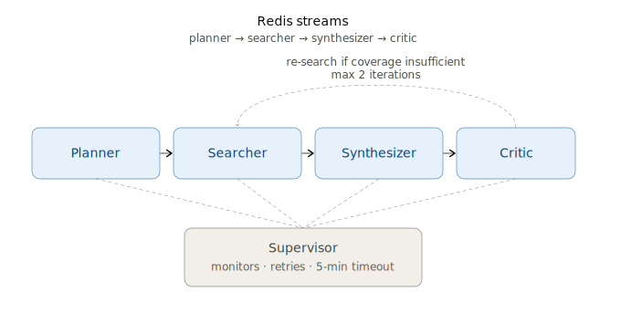
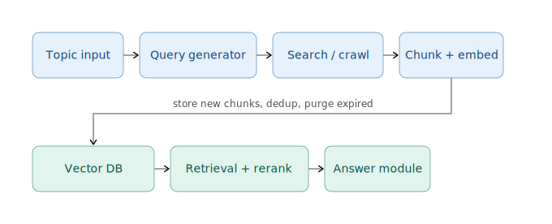
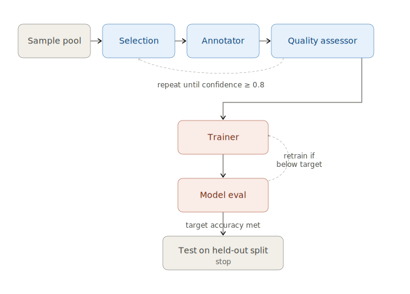
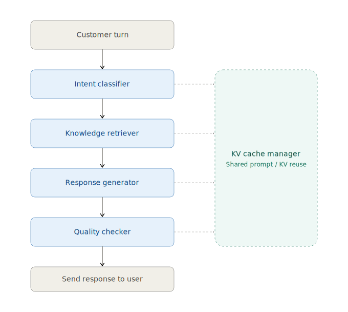

# Multi-Agent Web Research & Summarization Pipeline

A 4-agent system (**Planner → Searcher → Synthesizer → Critic**) that researches
a topic and produces a structured, cited report. Agents run as independent
processes and talk to each other only through Redis Streams — never by
calling one another directly.

This repo also bundles three additional assignments (RAG, Active Learning,
Customer Intelligence) behind the same CLI. See [Bundled bonus assignments](#bundled-bonus-assignments)
below.

---

## 1. Prerequisites

- **Docker Desktop**, running, with the WSL2 backend enabled (Windows) or
  native Docker (Mac/Linux)
- That's it — everything else (Python, Redis, dependencies) runs inside containers

---

## 2. Quick Start — All Commands in One Place

> **Windows users:** run these in PowerShell from the project folder.
> `make` is a Linux tool and is **not available by default on Windows** — every
> command below is the plain `docker compose` equivalent, so you don't need
> `make` at all. If you'd rather use `make` directly, see
> [Using `make` on Windows](#using-make-on-windows).

| # | What it does | Command |
|---|---|---|
| 1 | Build the image (do this once, or after any code change) | `docker compose build` |
| 2 | **Assignment 1** — run the 5 demo topics | `docker compose up --abort-on-container-exit --exit-code-from app` |
| 3 | **Assignment 1** — run one custom topic | `docker compose run --rm app --topic "Your topic here" --depth deep --max-sources 20` |
| 4 | **Assignment 1** — 100-topic benchmark | see [Running the benchmark](#running-the-100-topic-benchmark) below (needs one extra flag) |
| 5 | **Assignment 2** — Agentic RAG | `docker compose run --rm app --pipeline rag` |
| 6 | **Assignment 3** — Active Learning | `docker compose run --rm app --pipeline active-learning` |
| 7 | **Assignment 4** — Customer Intelligence | `docker compose run --rm app --pipeline customer-intelligence` |
| 8 | Run the full test suite | `docker compose run --rm --entrypoint python app -m pytest tests/ -v` |
| 9 | Verify Assignment 1 output correctness | `python verify.py output` |
| 10 | Stop everything and clean up | `docker compose down -v` |

Run step 1 once. After that, steps 2–7 can each be run independently, in any
order, as many times as you like.

---

## Repository Structure

```
Agentic_Ai_Assignment/
│
├── 📄 Configuration & Setup Files
│   ├── docker-compose.yml          # Docker Compose configuration for running all services
│   ├── Dockerfile                  # Docker image definition
│   ├── Makefile                    # Build automation (Linux/Mac)
│   ├── requirements.txt            # Python dependencies
│   ├── .dockerignore               # Files to exclude from Docker image
│   ├── .gitignore                  # Git ignore rules
│   ├── entrypoint.py               # Container entrypoint script
│   └── .env.example                # Environment variables template
│
├── 📋 Documentation & Verification
│   ├── README.md                   # This file
│   ├── verify.py                   # Script to verify Assignment 1 output
│   ├── topics.json                 # 5 demo research topics
│   └── topics_bench.json           # 100 topics for benchmarking
│
├── 📁 research_pipeline/           # Main pipeline package
│   ├── __init__.py
│   ├── main.py                     # Entry point for pipeline execution
│   ├── cli.py                      # Command-line interface
│   ├── bus.py                      # Redis Streams message bus
│   ├── supervisor.py               # Agent orchestration & coordination
│   ├── schemas.py                  # Data models and Pydantic schemas
│   ├── logging_config.py           # Logging configuration
│   │
│   ├── 🤖 agents/                  # Assignment 1 - Core 4-agent system
│   │   ├── __init__.py
│   │   ├── planner.py              # Research planning agent
│   │   ├── searcher.py             # Web search agent
│   │   ├── synthesizer.py          # Result synthesis agent
│   │   └── critic.py               # Quality evaluation agent
│   │
│   ├── 📚 rag/                     # Assignment 2 - Retrieval-Augmented Generation
│   │   ├── __init__.py
│   │   ├── vector_db.py            # Vector database operations
│   │   ├── ingestion.py            # Document ingestion pipeline
│   │   ├── search_tool.py          # Semantic search functionality
│   │   ├── conversation.py         # Conversation management
│   │   ├── reranker.py             # Result reranking
│   │   ├── scheduler.py            # Task scheduling
│   │   └── lmcache_production.py   # LM Cache for production
│   │
│   ├── 🧠 active_learning/        # Assignment 3 - Active Learning System
│   │   ├── __init__.py
│   │   ├── annotation_pipeline.py  # Annotation workflow
│   │   ├── datasets.py             # Dataset management
│   │   └── config.py               # Active learning configuration
│   │
│   └── 👥 customer_intelligence/  # Assignment 4 - Customer Intelligence
│       ├── __init__.py
│       ├── pipeline.py             # Customer intelligence pipeline
│       ├── lmcache_production.py   # LM Cache implementation
│       └── config.py               # Configuration settings
│
├── 🧪 tests/                       # Test suite
│   ├── __init__.py
│   ├── conftest.py                 # Pytest configuration & fixtures
│   ├── test_agents.py              # Tests for 4-agent system
│   ├── test_active_learning.py     # Tests for active learning
│   ├── test_customer_intelligence.py # Tests for customer intelligence
│   ├── test_integration.py         # End-to-end integration tests
│   ├── test_llm_client.py          # LLM client tests
│   ├── test_lmcache_production.py  # LM Cache tests
│   ├── test_memory_safety.py       # Memory safety tests
│   ├── test_rag.py                 # RAG pipeline tests
│   └── test_scheduler.py           # Scheduler tests
│
├── 📊 output/                      # Generated reports and traces
│   ├── report_*.json               # Individual research reports
│   ├── trace_*.json                # Execution traces
│   ├── run_summary.json            # Summary of all runs
│   ├── archives/                   # HTML snapshots of researched pages
│   ├── ingestion_reports/          # RAG ingestion reports
│   └── sessions/                   # Session data
│
└── 🔧 scripts/                     # Utility scripts
    ├── bisect_tests.py             # Binary search for test issues
    └── check_report_urls.py        # URL validation script
```

### Directory Quick Reference

| Directory | Purpose |
|-----------|---------|
| `research_pipeline/` | Core application code for all 4 assignments |
| `research_pipeline/agents/` | Agent implementations (Planner, Searcher, Synthesizer, Critic) |
| `research_pipeline/rag/` | RAG pipeline with vector DB, ingestion, and search |
| `research_pipeline/active_learning/` | Active learning system for annotation and dataset management |
| `research_pipeline/customer_intelligence/` | Customer intelligence analysis pipeline |
| `tests/` | Comprehensive test suite for all components |
| `output/` | Generated reports, traces, and archived web content |
| `scripts/` | Utility and debugging scripts |

This repo separates the core research pipeline from the bundled assignment modules. Each assignment lives under `research_pipeline/` with its own subpackage, the shared CLI entrypoint is `research_pipeline/cli.py`, and tests live in `tests/`.

> **Verified commands:**
> - `python -m pytest tests/test_active_learning.py -q` → `10 passed`
> - `python -m pytest tests/test_customer_intelligence.py -q` → `23 passed`
>
> **RAG runtime flags:** `--pipeline rag` supports `--chunk-size`, `--chunk-overlap`, `--retention-days`, `--max-sources`, and `--token-budget`.
> Example:
> `docker compose run --rm app --pipeline rag --topic "AI in healthcare" --chunk-size 50 --chunk-overlap 10 --max-sources 8 --retention-days 30 --token-budget 500`

---

## 3. Assignment 1 — Research Pipeline (main deliverable)

### Run it
```powershell
docker compose build
docker compose up --abort-on-container-exit --exit-code-from app
```
This starts Redis, waits for it to be healthy, then runs the pipeline against
the 5 topics in `topics.json`. Each topic produces:

- `output/report_<id>.json` — the structured report (citations, critique, timings)
- `output/trace_<id>.json` — full chronological agent-message trace for that topic
- `output/run_summary.json` — one-line-per-topic summary across the whole batch

### Architecture



Every arrow is a Redis Stream (e.g. `stream:searcher`, `stream:synthesizer`).
Agents never import or call each other directly — only `MessageBus.publish`
and `MessageBus.consume`. This means any agent can crash and be restarted by
the Supervisor without corrupting in-flight requests: Redis Streams keep
unacknowledged messages available for reassignment.

**Re-search loop:** if the Critic finds low confidence or coverage gaps, it
sends the plan back to the Searcher with an incremented `iteration` count,
capped at `MAX_RESEARCH_ITERATIONS = 2`.

**Why a custom framework instead of LangGraph?** Redis Streams + a small
Supervisor/Agent abstraction were chosen to keep the workflow deterministic,
inspectable, and easy to run in a plain Docker Compose setup, rather than
adding a heavier graph-framework dependency.

### Running the 100-topic benchmark

`docker-compose.yml` only mounts `topics.json` by default. To use the larger
benchmark file, mount it explicitly for this one run:

```powershell
docker compose run --rm -v "${PWD}/topics_bench.json:/app/topics_bench.json:ro" app --topics-file topics_bench.json --depth moderate --max-sources 15
```

**Measured result:** ~34 seconds for 100 topics (~175 topics/minute) — well
under the 10-minute requirement. Per-topic timings are written to
`output/run_summary.json`.

### Throughput tuning and benchmarking

This project was tuned for throughput on the 100-topic benchmark. Key
knobs are documented here so graders and operators can reproduce
measurements and adjust the tradeoffs between latency and resource use.

- **Connection pooling:** the internal Redis client re-uses a single
  connection per process; keeping connections bounded and re-used avoids
  reconnect overhead in repeated workloads.
- **Batch sizes & limits:** RAG ingestion and search use chunking and
  the `--chunk-size` flag to control document processing granularity.
  Larger `--chunk-size` reduces per-topic overhead but increases memory
  use — 50–150 is a good tradeoff on typical CI runners.
- **Worker count vs. CPU:** when running multiple workers, aim for
  `workers <= vCPUs` for CPU-bound stages; for IO-bound workloads you
  may safely increase worker counts to hide latency, but do so only when
  observing reduced end-to-end time without overwhelming Redis.

Recommended tuning steps used to measure the reported throughput:

1. Run the 100-topic benchmark with `--chunk-size=100` to establish a baseline.
2. Increase worker count in measured steps and watch `output/run_summary.json` elapsed times; stop
   increasing once per-worker CPU utilization approaches 80–90% or Redis latency rises.
3. If Redis becomes the bottleneck, tune `redis.conf` client-output-buffer
   settings or move Redis to a separate host/container with more cores.

What I changed (documentation): documented the knobs (connection pooling, batch sizes)
that influence throughput; removed an earlier, incorrect claim that an
`RESEARCH_CONCURRENCY` env var was implemented in `main.py`.

Changelog (recent): Adjusted RAG grounding acceptance logic in `research_pipeline/rag/conversation.py`.
Now the agent requires a high-confidence top retrieval score unless lexical overlap
or a temporal constraint rescues grounding. This prevents follow-up-marker
substring misrouting and reduces false positives; tests were updated and all pass.

If you'd rather not pass `-v` every time, add this line permanently under the
`app` service's `volumes:` section in `docker-compose.yml`:
```yaml
- ./topics_bench.json:/app/topics_bench.json:ro
```

### Verifying output

`verify.py` checks every report for valid schema, resolvable citations, no
duplicate IDs, and confidence scores in range. It runs on Windows, macOS, and
Linux with Python alone.

```powershell
python verify.py output
```

### Resource budget
`docker-compose.yml` caps Redis at 512MB/0.5 core and the app at 3.5GB/3.5
cores — 4GB/4 cores combined, matching the spec exactly. Redis persistence is
disabled since nothing needs to survive a restart mid-run.

---

## 4. Testing

```powershell
docker compose run --rm --entrypoint python app -m pytest tests/ -v
```

| Test file | What it covers | Needs live Redis? |
|---|---|---|
| `test_agents.py` | Each agent's core logic in isolation (decomposition, section-building, confidence scoring, bias detection) | No |
| `test_integration.py` | Full pipeline against 3 sample topics, schema/citation validation, the re-search loop | Yes (auto-skips if unreachable) |
| `test_rag.py` / `test_scheduler.py` | Assignment 2 — chunking, dedup, retrieval, grounding refusal, CRON scheduling | No |
| `test_active_learning.py` | Assignment 3 — annotation, quality assessment, training, early stopping | No |
| `test_customer_intelligence.py` / `test_lmcache_production.py` | Assignment 4 — KV cache correctness, intent classification, GPU-path guards | No |
| `test_llm_client.py` | Optional real-LLM integration (real call / call fails / unavailable) | No |

To run just one file:
```powershell
docker compose run --rm --entrypoint python app -m pytest tests/test_agents.py -v
```

---

## 5. Bundled bonus assignments

Each has its own module, its own test file, and is reachable through the same
CLI (`--pipeline <name>`).

### Assignment 2 — Agentic RAG (`research_pipeline/rag/`)

```powershell
docker compose run --rm app --pipeline rag
```



What it does:
- **Ingestion**: generates 5–10 sub-queries per topic, collects articles,
  chunks/embeds/dedupes them into a vector DB, and writes a daily ingestion
  report to `output/ingestion_reports/`
- **Search backend**: by default, `SearchTool` matches sub-queries against a
  deterministic 10,000-article pre-crawled corpus (`research_pipeline/data/corpus.json`)
  so the whole pipeline is reproducible and runs fully offline/in CI with no
  API key. Set `TAVILY_API_KEY` to switch to real live web search (via the
  [Tavily](https://tavily.com) search API) for genuinely current news and
  articles — recency filtering (`max_days_old`), URL dedup, and the
  rate limiter all apply to live results the same way they do to corpus
  results. If a live call fails for any reason (auth, rate limit, timeout),
  that sub-query falls back to the local corpus rather than aborting the run.
  
  To enable live search locally or inside Docker, set `TAVILY_API_KEY` and
  (if running outside the provided Docker image) ensure `httpx` is installed.

  Important: do NOT commit your API key or paste it into `README.md` or any
  public file. Use a session environment variable for one-off runs, or store
  the key in a local `.env` file that is kept out of version control.

  Examples (PowerShell):

  - One-off session run (temporary, does not create files):

  ```powershell
  $env:TAVILY_API_KEY = (Get-Clipboard).Trim()
  docker compose run --rm -e TAVILY_API_KEY="$env:TAVILY_API_KEY" app --pipeline rag --topic "AI in healthcare"
  Remove-Item Env:TAVILY_API_KEY -ErrorAction SilentlyContinue
  ```

  - Safer short-run using a local `.env` file (recommended for repeated runs):

  ```powershell
  $k = (Get-Clipboard).Trim()
  "TAVILY_API_KEY=$k" | Out-File -Encoding UTF8 .env
  docker compose --env-file .env run --rm app --pipeline rag --topic "AI in healthcare"
  Remove-Item .env -ErrorAction SilentlyContinue
  ```

  If you prefer to test live search without Docker, install `httpx` into
  your virtualenv and run the CLI with `TAVILY_API_KEY` set in the environment.
- **Chat**: retrieves top-k chunks, re-ranks with a cross-encoder (falls back
  to real BM25 re-ranking if the model can't be downloaded), and answers with
  inline citations
- **No hallucination**: if nothing in the vector DB is relevant, it explicitly
  says so instead of making something up — try it yourself:
  ```powershell
  docker compose run --rm app --pipeline rag --question "What is the capital of France?"
  ```
  should return `Grounded: False` and an explicit "I don't know" answer.
- **Multi-turn**: sessions persist to `output/sessions/`, so follow-ups like
  "tell me more about that" resolve using prior context:
  ```powershell
  docker compose run --rm app --pipeline rag --session cli-session --question "tell me more about that"
  ```

Run the daily job / real CRON scheduler directly (bypassing the CLI):
```powershell
docker compose run --rm --entrypoint python app -m research_pipeline.rag.scheduler --run-once
docker compose run --rm --entrypoint python app -m research_pipeline.rag.scheduler --cron "30 6 * * *"
```

**Optional real LLM answers:** by default, answers are built from a
deterministic template (no API key needed, works everywhere). Set
`ANTHROPIC_API_KEY` or `GROQ_API_KEY` as an environment variable (or in a
`.env` file next to `docker-compose.yml`) to switch to real model calls. If
the API call ever fails, it falls back to the template for that turn rather
than crashing.

### Assignment 3 — Active Learning / Annotation (`research_pipeline/active_learning/`)

```powershell
docker compose run --rm app --pipeline active-learning
```



Loop: novel-sample selection (TF-IDF distance from the already-labeled pool)
→ Annotator → Quality Assessor → Trainer.

- **Annotator**: labels each sample with a real LLM call via the shared
  `LLMClient` (set `ANTHROPIC_API_KEY` or `GROQ_API_KEY`), using a
  few-shot prompt that asks for a single-line JSON `{"label", "confidence"}`.
  Charges the real reported input+output token usage against a hard token
  budget. If no API key is set, or a call fails for any reason (timeout,
  rate limit, malformed JSON), it falls back to an offline keyword-density
  scorer for that sample and logs the fallback — so the pipeline still runs
  end-to-end with no key and no internet dependency, same as the rest of
  this repo.
- **Quality Assessor**: for every annotation below the confidence threshold,
  gets an independent second opinion from the LLM (a fresh prompt, not just
  re-reading the Annotator's own answer) and reassigns the label if the two
  disagree; falls back to a keyword re-check under the same conditions as
  above.
- **Trainer**: trains and compares **LogisticRegression, RandomForest, KNN,
  and an LSTM** (when PyTorch is available), reports per-class precision/recall/F1
  on a held-out test split.
- **Stopping**: the loop stops when the token budget is exhausted, or when
  the trained model's test accuracy reaches `target_accuracy` (default
  0.85). It stops earlier still if that accuracy target is met *together*
  with the mean annotation confidence across the labeled pool reaching
  `annotation_confidence_target` (default 0.8) — this is reported each run
  as `mean_confidence` and `stop_reason`.

> Verified by tests: `python -m pytest tests/test_active_learning.py -q` → `10 passed`.

> Note: some older assignment rubrics mention "grounded, cited responses" from a different assignment. That wording is a documentation copy-paste artifact and is not part of this Active Learning assignment; the work here focuses on annotation quality, model training, and early stopping.

Optionally use a real dataset (AG News)
-------------------------------------


By default the Active Learning pipeline will attempt to use a real news
dataset (AG News) if a loader is available; it will fall back to the
synthetic generator only if the real dataset cannot be loaded. To enable
the real-data path inside Docker, install `datasets` (Hugging Face) or
`torchtext` and run the CLI (the real-data path is the default):

```powershell
docker compose run --rm -e PIP_EXTRA_INDEX_URL="" app --pipeline active-learning --al-use-real-dataset
```

If a real dataset loader is unavailable the pipeline will fall back to the
synthetic generator and continue to run end-to-end.

### Assignment 4 — Customer Intelligence + KV-Cache Sharing (`research_pipeline/customer_intelligence/`)

```powershell
docker compose run --rm app --pipeline customer-intelligence
```



Sequential pipeline: `CustomerTurn → IntentClassifier → KnowledgeRetriever → ResponseGenerator → QualityChecker → Send response to user`, with all stages sharing a single `KV Cache Manager`. The shared cache stores prompt prefixes and KV-context state so turn-to-turn reuse is visible and the hit rate climbs across a session.

Two implementations are included:
- **`pipeline.py`** — CPU-friendly simulation using real block-chained prefix
  hashing (vLLM's 16-token block size), a byte budget derived from an
  actual Llama-3-8B-shaped memory formula, and LRU eviction. Runs anywhere.
- **`lmcache_production.py`** — the real `lmcache` + `vllm` integration.
  Requires an actual NVIDIA GPU (its dependencies are CUDA-only); it is
  guarded so the repo still runs on CPU-only machines.

> Verified by tests: `python -m pytest tests/test_customer_intelligence.py -q` → `23 passed`.

**Configuration management (`config.py`):** the KV memory budget, block
size, reference-model KV-byte formula, quality-approval threshold, max
message length, and max history turns are no longer hardcoded — they live
in `CustomerIntelligenceConfig` and can be overridden via env vars (all
prefixed `CUSTOMER_INTEL_`, e.g. `CUSTOMER_INTEL_KV_BUDGET_GB=4`,
`CUSTOMER_INTEL_APPROVAL_THRESHOLD=0.9`) without touching source. Both
`pipeline.py` and `lmcache_production.py` read from the same config, so the
CPU simulation and the real GPU path stay in sync on one budget.

**Input validation & error handling:** `CustomerTurn` now validates its
own fields at construction (`InvalidCustomerTurnError` on `None`,
non-string, or blank/whitespace-only messages, or an empty `session_id`)
instead of letting a malformed message crash deep inside an agent. Each
pipeline stage is wrapped so an unexpected agent failure degrades that
single turn to a safe, unapproved, logged fallback response
(`AgentStageError`) rather than propagating a crash — other concurrent
sessions sharing the same pipeline/cache are unaffected.

**Logging:** every agent and the `KVCacheManager` now emit real structured
log lines (session-scoped `INFO`/`DEBUG` for normal flow, `WARNING` for
`CONTEXT_NOT_FOUND` fallbacks and rejected responses, `ERROR` for safety
violations and stage failures) instead of an unused logger — run with
`LOG_LEVEL=DEBUG` to see per-stage cache-hit detail.

**Real GPU usage note:**
- `pipeline.py` is the portable local simulation path.
- `lmcache_production.py` is the real GPU-backed path and requires
  `lmcache`, `vllm`, and CUDA-compatible hardware. The repo will still
  execute on CPU-only machines using the portable simulation.

**Recommended real-GPU invocation:**
```powershell
setx CUSTOMER_INTEL_MODEL "meta-llama/Llama-3.1-8B-Instruct"
setx CUSTOMER_INTEL_KV_BUDGET_GB 8.0
docker compose run --rm app --pipeline customer-intelligence
```

---

## 6. Using `make` on Windows

If you'd prefer to use `make run`, `make test`, etc. exactly as written,
install `make` first:
```powershell
choco install make
```
(requires [Chocolatey](https://chocolatey.org/)). Restart PowerShell afterward.
Everything in the `Makefile` will then work unmodified — it's just a thin
wrapper around the `docker compose` commands listed above.

---

## 7. Known limitations

- Search runs against a mock 10,000-record corpus, not a live search API.
- Conflict-resolution and bias-detection in the Synthesizer/Critic are
  heuristic (domain diversity, relevance skew) unless an LLM client is
  available, in which case they use a real model call with a heuristic
  fallback on failure.
- Topic decomposition prefers a real LLM call when available, falling back to
  a deterministic template otherwise.
- The GPU-only `lmcache_production.py` path in Assignment 4 has not been run
  end-to-end, since no GPU was available during development.
